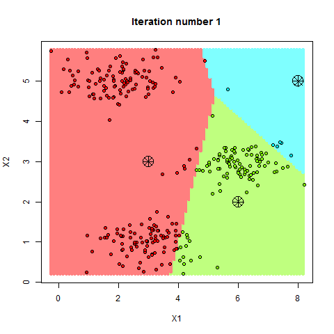

Vector quantization is a technique used to compress high-dimensional vectors, which can significantly reduce memory consumption in vector databases. This is particularly useful when dealing with large datasets or when deploying models on resource-constrained devices.

## Quantization methods

There are several quantization methods that can be employed to reduce the memory footprint of vectors:

### Binary quantization

Binary quantization is the simplest form of quantization, where each component in a vector is converted from a float32 to a single bit. This is done by rounding each component in a given vector to $$$0$$$ if it is $$$\le 0$$$ or $$$1$$$ if it is $$$\gt 0$$$. This converts a float32 component to a single bit (0 or 1), which greatly reduces the memory consumption of the vector.

Binary quantization can be defined as:

$$$
Q(v) = \begin{cases}
0 & \text{if } v_i \le 0, \\
1 & \text{if } v_i \gt 0
\end{cases}

\\

\text{where } v_i \text{ is the } i\text{-th component of vector } v \in \mathbb{R}^D \text{ for } 0 \le i \lt D
$$$

#### Example

Here we will use binary quantization on a 5-dimensional vector:

```py
[0.62  -0.14   0.31   0.97  -0.53]
  ↓      ↓      ↓      ↓      ↓
[ 1      0      1      1      0 ]
```

If I had a 1536-dimensional vector, it would originally consume $$$\frac{1536 * 32}{8} = 6144 \text{ bytes}$$$. After binary quantization, it would only consume $$$\frac{1536 * 1}{8} = 192 \text{ bytes}$$$. That's a reduction of $$$\approx 97\%$$$ in memory consumption!

The trade-off with binary quantization is that it can lead to a loss of semantic meaning, as the original values are not entirely preserved. However, it can still be effective for certain applications where high precision is not critical.

### Scalar quantization

$$$
Q(v) = \frac{|v - m|}{\Delta} + 1 \\
\text{Where } m \text{ is the min of each dimension, } \Delta \text{ is the size of the quantization bins}
$$$

### Product quantization

Product quantization is a more advanced quantization method which uses a technique called _sub-vector quantization_ to compress high-dimensional vectors using a set of centroids. This method is particularly useful for large datasets and can achieve significant memory savings while maintaining a reasonable level of accuracy.

#### Example:

1. We have a 6-dimensional index ($$$D = 6$$$) where we would like to apply product quantization to the following vector:

$$$
v = \begin{bmatrix}
0.62  \\
-0.14   \\
0.31   \\
0.97  \\
-0.53  \\
0.45
\end{bmatrix}
$$$

2. We then choose to split the vector into $$$m = 3$$$ sub-vectors, each with dimensions $$$D' = \frac{D}{m} = 2$$$.

$$$
u_1 = \begin{bmatrix}
0.62  \\
-0.14
\end{bmatrix}

u_2 = \begin{bmatrix}
0.31   \\
0.97
\end{bmatrix}

u_3 = \begin{bmatrix}
-0.53  \\
0.45
\end{bmatrix}
$$$

Note: the chosen $$$m$$$ value must divide $$$D$$$ (i.e. $$$D \text{ mod } m = 0$$$).

3. We then generate $$$\frac{D}{D'} = 3$$$ _codebooks_ for each sub-vector. A codebook is a set of centroids in a $$$D'$$$-dimensional space, which are used to approximate each sub-vector. For example, let's assume we have the following 3 codebooks:

$$$
c_1 = \begin{bmatrix}
c_{1_1} \\
c_{1_2} \\
c_{1_3} \\
c_{1_4}
\end{bmatrix}

c_2 = \begin{bmatrix}
c_{2_1} \\
c_{2_2} \\
c_{2_3} \\
c_{2_4}
\end{bmatrix}

c_3 = \begin{bmatrix}
c_{3_1} \\
c_{3_2} \\
c_{3_3} \\
c_{3_4}
\end{bmatrix}
$$$

Where $$$c_{i_j}$$$ is a $$$D'$$$-dimensional centroid used to approximate the $$$i$$$-th sub-vector of any given vector.

Note: the number of centroids generated per sub-vector is $$$= 2^{\text{nbits}}$$$ where $$$\text{nbits}$$$ is the number of bits allocated to each single value in our outputted compressed vector. Currently, in an uncompressed vector like $$$v$$$, $$$\text{nbits} = 32$$$ as vectors originally store float32 values. In the example above, we set $$$\text{nbits} = 2$$$ which creates $$$2^\text{nbits} = 4$$$ centroids per codebook.

4. Given our sub-vectors above, we can then approximate each sub-vector by finding the closest centroid in each codebook using simple Euclidean distance. Let's say after computing the nearest centroids to each sub-vector, we approximate them as follows:
$$$
u_1 \approx c_{1_2} \\
u_2 \approx c_{2_3} \\
u_3 \approx c_{3_1}
$$$

In our original vector, we can replace each sub-vector with its corresponding centroid index $$$j$$$ in its respective codebook. We will denote the quantized vector as $$$Q(v)$$$:

$$$
v = \begin{bmatrix}
0.62  \\
-0.14   \\
0.31   \\
0.97  \\
-0.53  \\
0.45
\end{bmatrix}

\rightarrow

v = \begin{bmatrix}
u_1 \\
u_2 \\
u_3
\end{bmatrix}

\rightarrow

v \approx \begin{bmatrix}
c_{1_2} \\
c_{2_3} \\
c_{3_1}
\end{bmatrix}

\rightarrow

Q(v) = \begin{bmatrix}
2 \\
3 \\
1
\end{bmatrix}
$$$

Given that $$$\text{nbits} = 2$$$, that means that centroids indexes can be stored in only 2 bits (0-3). This means that $$$v$$$ consumed $$$6 \times 32 = 192$$$ bits, but $$$Q(v)$$$ now only consumes $$$3 \times 2 = 6$$$ bits. This is a memory reduction of $$$\approx 97\%$$$!

The memory consumption of a vector passed through product quantization can be calculated as follows:
$$$
\text{Memory consumption} = m \times \text{nbits}
$$$

Where $$$m = \frac{D}{D'}$$$ is the number of sub-vectors, $$$D$$$ is the dimension of the initial vector, $$$D'$$$ is the dimension of each sub-vector, and $$$\text{nbits}$$$ is the number of bits allocated to each centroid index.

#### Generating the codebooks

One of the challenges with product quantization is generating the codebooks. This is because when approximating a sub-vector to a centroids in a codebook creates loss. This means that the centroids we decide to use will directly affect how lossy the quantization will be, therefore affecting the overall accuracy of results in the vector database.

A common approach for generating codebooks is to use a clustering algorithm, like [_k-means clustering_](https://en.wikipedia.org/wiki/K-means_clustering). K-means clustering is a machine learning algorithm that partitions a set of vectors into $$$k$$$ clusters, where each cluster is represented by its centroid. As with most machine-learning algorithms, k-means needs to _learn_ the shape of data it's given to accurately partition it.

<div align='center'>
  
  <sub>Visual example of k-means clustering. [Source](https://sandipanweb.wordpress.com/2016/08/)</sub>
</div>

Given a dataset of many vectors, when using product quantization, you must split all vectors in the dataset each into $$$m$$$ sub-vectors. This creates $$$m$$$ sub-spaces, each of dimension $$$D'$$$. K-means clustering can then be applied to each of these sub-spaces to learn the shape of the sub-vectors in each created sub-space, generating centroids that best approximate the sub-vectors in that sub-space. This will result in $$$m$$$ codebooks that greatly reduce the loss when approximating sub-vectors to centroids.

Since k-means clustering is a machine learning algorithm which needs to "learn" the shape of data, it is important to note that a vector database using product quantization will need to be trained on a given dataset of vectors before it can be used effectively. This training process involves running k-means clustering on the dataset to generate the codebooks, which can then be used for accurate quantization. Although, if a different dataset is used on the same trained database, the database must be re-trained to regenerate the codebooks as it needs to "re-learn" the shape of the new data to ensure accurate quantization.

## Comparison of quantization methods

...