## How do we store your vectors?

EigenDB stores your vectors in a [_Hierarchical Navigable Small World (HNSW)_](https://arxiv.org/abs/1603.09320) graph to perform similarity search with the highest level of efficiency and speed.

## Under the hood

Algorithms to store and query vectors in an HNSW graph is implemented in EigenDB through our open-source Go library [faissgo](https://github.com/Eigen-DB/eigen-db/tree/main/libs/faissgo). This library offers lightweight Go bindings for Meta's [Faiss](https://engineering.fb.com/2017/03/29/data-infrastructure/faiss-a-library-for-efficient-similarity-search/), a popular C++ library for efficient similarity search and clustering of dense vectors released by [Facebook AI Research (FAIR)](http://ai.meta.com/research/).

This library allows EigenDB to integrate the power of Faiss inside of its Go ecosystem. In addition, the wrapper was made into an open-source library instead of including it in EigenDB, as this allows other developers to easily integrate Faiss into their Go workflows.

```mermaid
graph TD
    App(🚀 Your Apps) --> SDK(🐍 Python SDK)
    SDK --> |Documents| Model(🧠 Model Provider\n e.g. OpenAI, Ollama)
    Model --> |"[0.1, -0.3, ...]"| SDK
    SDK --> |Store the embeddings| REST(🌐 EigenDB REST API)
    subgraph "📦 EigenDB Instance"
    REST --> EigenDB(⚙️ EigenDB Logic)
    EigenDB --> Faissgo(⚡faissgo)
    Faissgo --> Faiss(♾️ Faiss C++ Library)
    end
```

