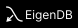

<div align="center">


### ⚡ The blazingly fast in-memory vector database 🚀 


[](https://www.gnu.org/licenses/gpl-3.0)
<a href="https://conventionalcommits.org">
    
</a>
<a href="http://commitizen.github.io/cz-cli/">
    
</a>

<!--<a href="https://semantic-release.gitbook.io/semantic-release">
    
</a>-->


[](#)

</div>

## Table of contents

1. [🔎 Overview](#overview)
2. [📖 Documentation](#documentation)
4. [🤝 Contributing](#contributing)
6. [💬 Contact Us](#contact-us)
---

### 🔎 Overview
* EigenDB is a light-weight in-memory vector database written in Go. It’s entirely open-source! ❤️
* Employs the _Hierarchical Navigable Small World_ (HNSW) algorithm to perform similarity search with the highest level of efficiency and speed.⚡
    * Logic surrounding the HNSW algorithm is handled by our open-source Go library, [_hnswgo_](https://github.com/Eigen-DB/hnswgo)! 🧠
* Basic database operations can be performed seamlessly through EigenDB's very simple [REST API](https://eigendb.mintlify.app/api-reference/api)! ✨

---

### 📖 Documentation

Our official documentation can be found [here](https://eigendb.mintlify.app/)!

If you feel like we missed something, feel free to [contribute](https://github.com/Eigen-DB/docs) to the docs! 

---

### 🤝 Contributing

Coming soon...

---

### 💬 Contact Us!

Email: ryanawad@yahoo.com

LinkedIn: https://www.linkedin.com/in/ryanawad/

---

Made with ❤️ by developers, for developers.


<!--
Payload to `/vector/bulk-insert` to create test data (must use 2D vector space) and a [visual](https://www.desmos.com/calculator/pjjei9akcx):

Keep in mind that in a real application, vector dimensionality is usually much larger depending on the complextiy and granularity of the data.

<details>
    <summary>Expand</summary>

```json
{
    "setOfComponents": [
        [3.2, -1.5],
        [4.7, 2.1],
        [-6.3, 3.4],
        [0.9, -4.8],
        [-2.7, 5.6],
        [1.3, -3.9],
        [2.4, 6.1],
        [-1.1, 3.0],
        [5.5, -2.2],
        [0.0, 4.4],
        [-3.6, -0.7],
        [4.1, 5.3],
        [-2.9, 2.8],
        [3.7, -3.6],
        [1.0, 0.5],
        [5.9, 1.7],
        [-4.4, -3.2],
        [2.8, 4.9],
        [-1.5, -2.4],
        [3.3, 1.6],
        [4.6, -1.3],
        [-2.1, 3.7],
        [1.8, -5.4],
        [3.9, 2.5],
        [-1.4, 4.2],
        [0.2, -3.1],
        [5.1, 1.3],
        [-2.8, -1.7],
        [3.0, 5.5],
        [1.5, -2.8],
        [-4.9, 3.1],
        [2.6, -4.5],
        [0.7, 3.8],
        [-3.3, 2.2],
        [4.0, -0.9],
        [-1.2, 4.9],
        [3.4, -2.6],
        [0.6, 1.8],
        [-2.5, -3.9],
        [5.3, 2.0],
        [-0.8, 3.3],
        [2.1, -4.2],
        [4.5, 1.4],
        [-3.7, -2.5],
        [1.9, 3.6],
        [0.3, -5.1],
        [4.8, -3.0],
        [-1.6, 2.9],
        [2.9, -4.0]
    ]
}
```

</details>

-->
